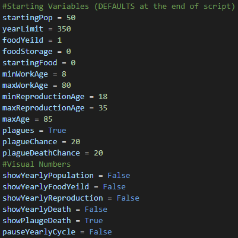

# Civilization Simulation

Made by **RangerRhino23**!

Civilization Simulation is a simulation that allows you to simulate a civilization. You can change tons of variables that contribute to the simulation. Everything is fully customizable and have tons of different outcomes.

After the simulation is run, you can view the population per year in a neat graph.

You can reach RangerRhino23 through one of these socials:

<a href="https://github.com/RangerRhino23" target="_blank">Github</a>, <a href="mailto:rangerrhino23@outlook.com" target="_blank">Email</a>, <a href="https://youtube.com/@RangerRhino23" target="_blank">Youtube</a>, <a href="https://RangerRhino23.ddns.net" target="_blank">Website</a> and Discord: RangerRhino#4484
